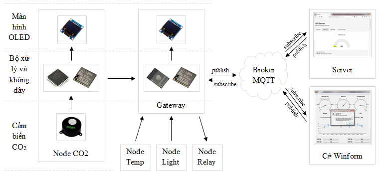
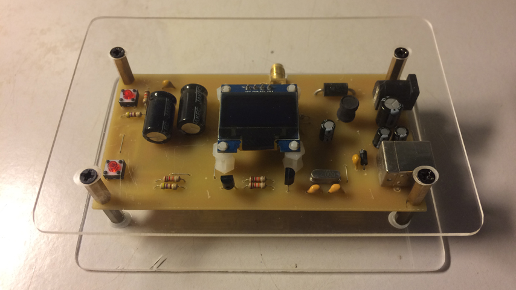
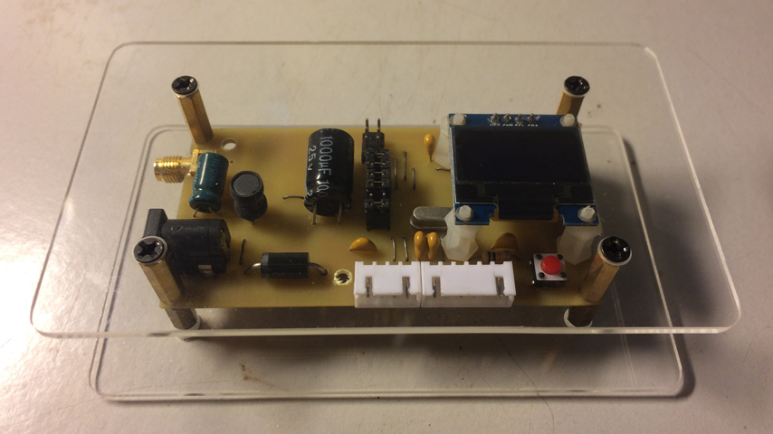
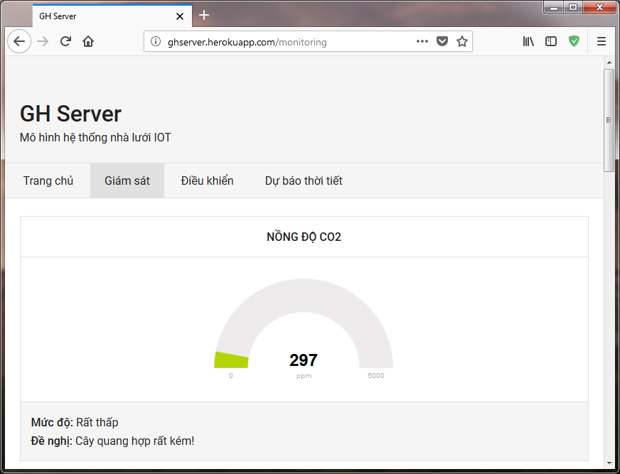
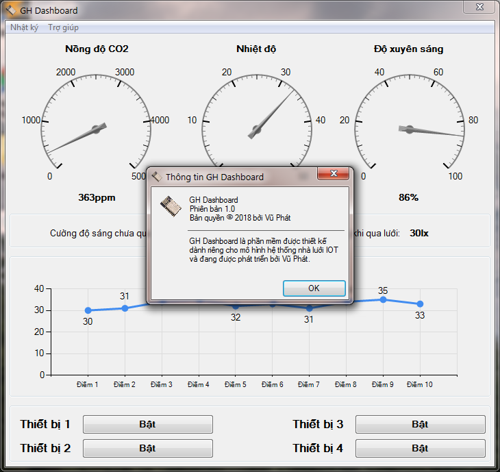

# Hệ thống nhà kính IOT ứng dụng LoRa
*Hệ thống nhà kính IOT ứng dựng LoRa được phát triển dựa trên ESP32, Arduino, LoRa, Nodejs và C# Winform*

### Giới thiệu
Đây là một dự án hoàn toàn mới tại Việt Nam, việc áp dụng IOT và công nghệ LoRa đã mở ra một bước đi mới trong nghành nông nghiệp. Đi đôi với cuộc cách mạng công nghệ 4.0, IOT là một phần thiết yếu để phát triển nông nghiệp. Với việc gần như được áp dụng vào thực tế, càng chứng tỏ đây chính là một dự án cấp thiết, việc nghiên cứu và phát triển thêm sẽ càng giúp cho đất nước chúng ta hội nhập và phát triển hơn nữa.

### Mô hình

Mô hình lấy Gateway làm trung tâm để xây dựng, Gateway được xây dựng bằng module ESP32, module LoRa Ra-01 và OLED, có nhiệm vụ là chờ tiếp nhận dữ liệu LoRa từ các Node cảm biến (Node CO2, Node Temp, Node Light), xử lý hiển thị OLED và publish chúng lên broker, sau đó được đẩy lên Server hoặc phần mềm điều khiển (C# Winform).

Node cảm biển, cụ thể ở đây là Node CO2 được xây dựng bằng vi điều khiển ATMega328, module LoRa Ra-01, OLED và cảm biến COZIR-AX-5000. Nhiệm vụ là đọc giá trị CO2 và truyền dữ liệu LoRa tới Gateway.

Gateway kết nối với Server hoặc phần mềm thông qua phương thức MQTT, đây là phương thức truyền nhanh, với tốc độ băng thông thấp, … Chúng có dạng publish/subscribe. Khi nhận được dữ liệu LoRa từ Node cảm biến. Gateway xử lý dữ liệu và publish lên broker một message thông qua một topic, lúc này Server hoặc phần mềm sẽ subscribe topic đó và lắng nghe liên tục message từ topic đó, chỉ cần có một dữ liệu gửi lên từ Gateway, lập tức Server và phần mềm sẽ cập nhật giá trị mới theo message đã nhận được, ngược lại, khi Server hoặc Gateway publish dữ liệu, Gateway sẽ subscribe và lắng nghe chúng, nếu có message gửi về từ Server hoặc phần mềm, lập tức Gateway nhận được và chuyển thành dữ liệu LoRa và truyền đi tức thời tới Node điều khiển (Node Relay).

Server được xây dựng trên nền tảng Node.js và phần mềm được xây dựng trên nền tảng C# .NET. Tất cả chúng đều đã có thư viện MQTT hỗ trợ, việc còn lại là do người lập trình sáng tạo chúng như thế nào mà thôi.

### Gateway

Gateway được xây dựng với hạt nhân là module ESP32 và module LoRa Ra-01. Module ESP32 sử dụng chip 32 bit lõi kép cho phép xử lý dữ liệu tốc độ cao, ổn định. Module LoRa Ra-01 sử dụng chip SX1278 hỗ trợ truyền không dây RF lên tận hàng Km.

### Node CO2

Node CO2 được xây dựng với vđk ATMega328 (Arduino), module LoRa Ra-01 và cảm biến COZIR-AX-5000. Cảm biến COZIR là cảm biến số cho phép đọc giá trị CO2 trực tiếp thông qua UART mà không cần phải tính toán gì nhiều.

### Server Nodejs

Server được xây dựng dựa trên nền tảng Node.js. Với việc sử dụng Socket.io cho phép Server hoạt động thời gian thực. Hệ thống đưa ra khuyến nghị ứng với từng giá trị. Ngoài ra còn có trang dự báo thời tiết cho phép xem tình hình thời tiết trong những ngày sắp tới.

### Phần mềm Winform

Phần mềm được xây dựng dựa trên nền tảng C# .NET. Hỗ trợ nhật ký cho phép người sử dụng theo dõi được sự thay đổi tức thời của các giá trị.

### Video demo hệ thống

[https://youtu.be/TktAAO-llQs](https://youtu.be/TktAAO-llQs)
